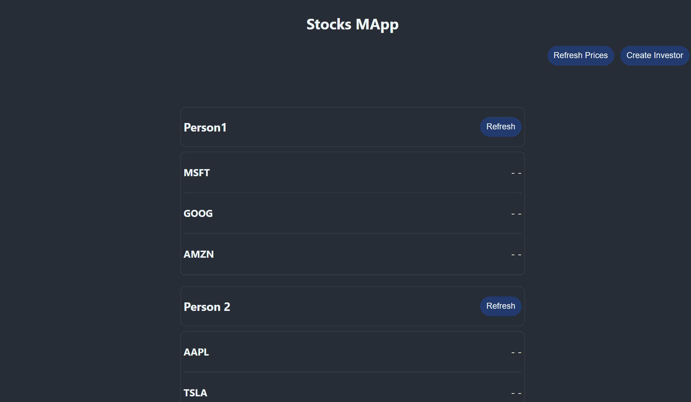

# Multi-lang-api

- Built a Flask API which scrapes Yahoo Finance(CA) using Beautiful Soup & AsyncIO and deploys multiple of these scrapers using Celery and Redis. (Python)
- Prefaced the above scraper API with another API built using Gin Framework and Gorm SQLite Database, to store user data and act as a middleware between user & the scraping api. This api uses Go's waitgroups and sub-routines to make requests to the scraper api and packages the data for user consumption. (Go)
- Built a simple UI using ReactJS which also leverages react-context for app-wide data access and granular components. (React/Javascript)
- Used Docker to containerize these applications
  (See images attached below for more details)

## Create Investor

## Fetch All

## Fetch Investor

